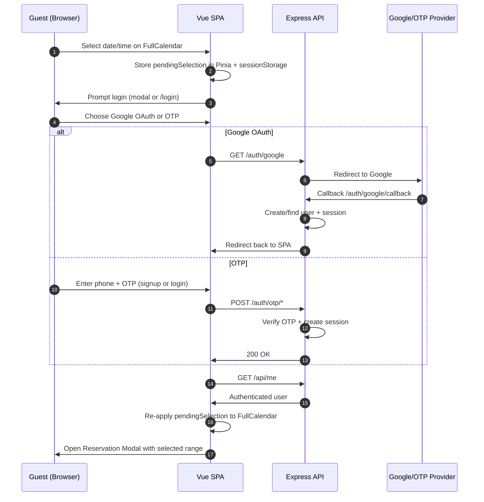
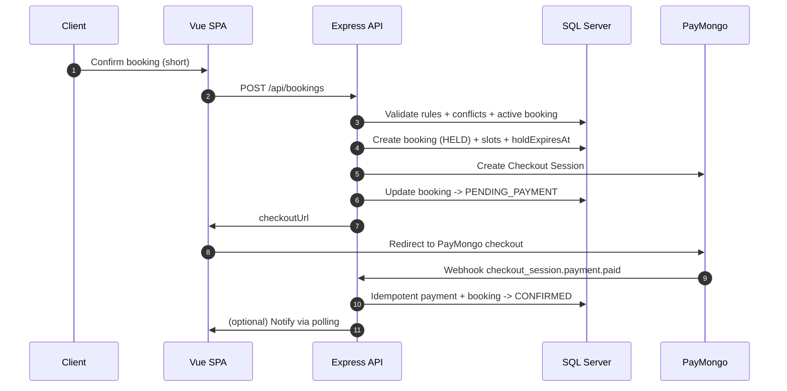
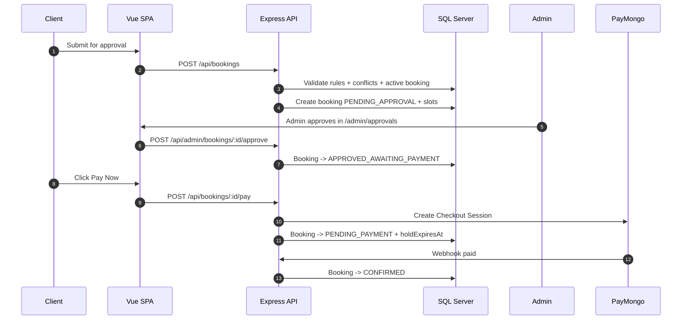
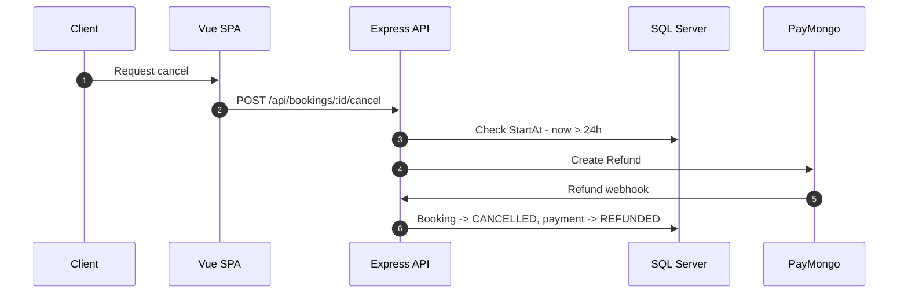
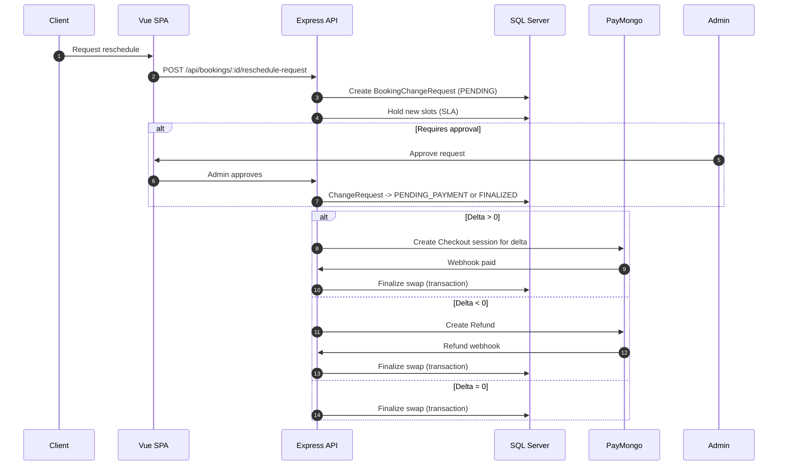

# Architecture & Sequence Diagrams

## System Overview
- **Frontend**: Vue 3 CSR + TypeScript + Pinia + Vue Router + FullCalendar.
- **Backend**: Node.js + Express.js (TypeScript) with MVC structure.
- **Database**: Microsoft SQL Server via `tedious`.
- **Auth**: Google OAuth (Passport) + Phone OTP (signup required).
- **Payments**: PayMongo Checkout + webhook confirmation.
- **Timezone**: Asia/Manila authoritative for rules and UI.

## Sequence Diagrams (Mermaid)

### 1) Guest Select -> Login -> Reservation Modal

### 2) Short Booking Pay Flow (1–2 hours)

### 3) Long Booking Approval -> Pay Flow (>=3 hours or whole-day)

### 4) Cancel Confirmed (Refund) Flow

### 5) Reschedule Confirmed (Delta Payment/Refund) Flow

