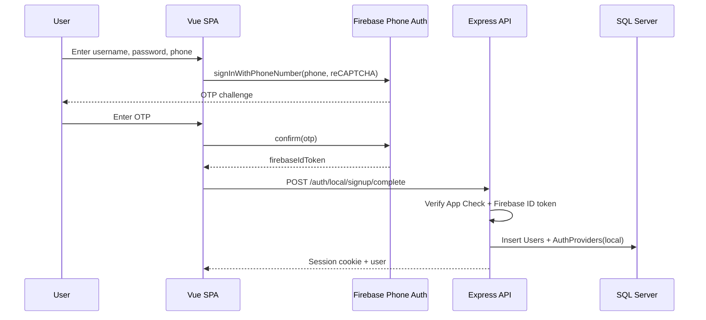
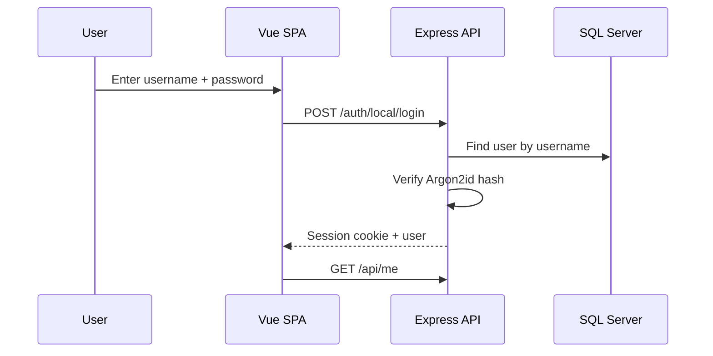
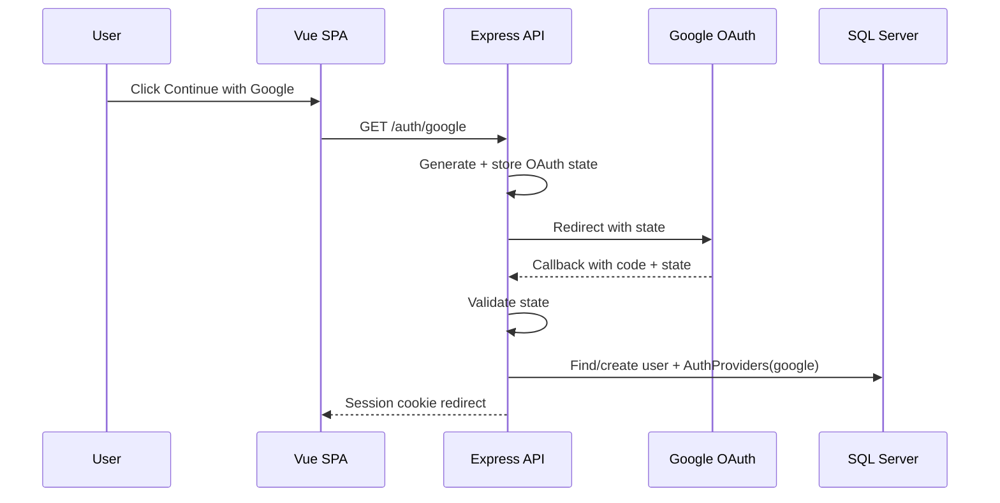
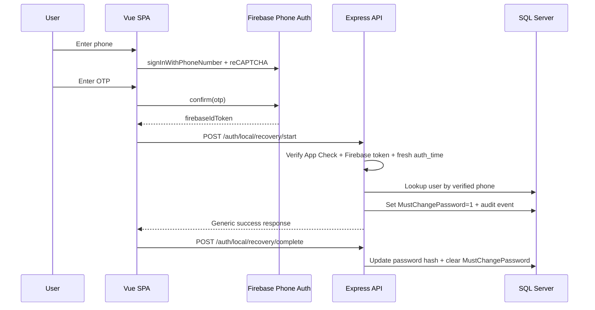
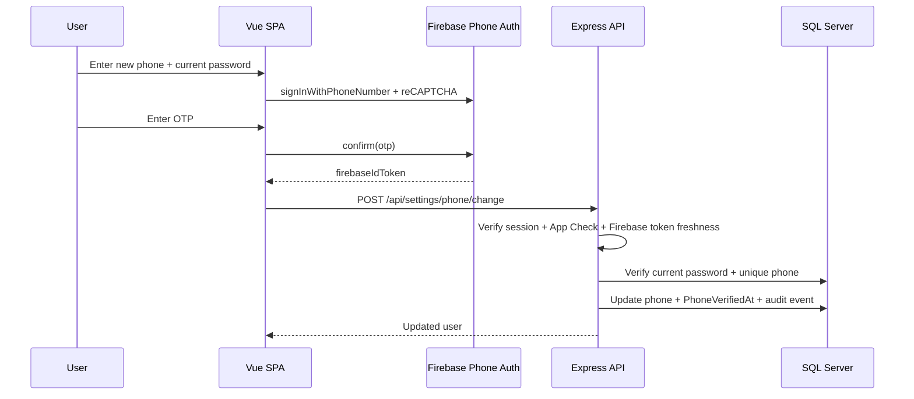

# Authentication & Account Management Revamp

## Sequence Diagrams

### 1) Local signup (Firebase OTP -> backend account create)

### 2) Local login

### 3) Google OAuth login

### 4) Forgot password (Firebase OTP -> forced reset)

### 5) Change phone (Firebase OTP)

## Backend MVC Layout (Auth module)
- `backend/src/controllers/authController.ts`
- `backend/src/services/authService.ts`
- `backend/src/repositories/userRepository.ts`
- `backend/src/routes/authRoutes.ts`
- `backend/src/middleware/appCheck.ts`
- `backend/src/middleware/csrf.ts`
- `backend/src/middleware/rateLimiters.ts`
- `backend/src/config/session.ts`
- `backend/src/config/passport.ts`
- `backend/src/config/firebaseAdmin.ts`

## Frontend Module Surface
- Routes: `/login`, `/signup`, `/forgot-password`, `/force-password-reset`, `/portal/settings`
- Views:
  - `frontend/src/views/LoginPage.vue`
  - `frontend/src/views/SignupPage.vue`
  - `frontend/src/views/ForgotPasswordPage.vue`
  - `frontend/src/views/ForcePasswordResetPage.vue`
  - `frontend/src/views/PortalSettings.vue`
- Store: `frontend/src/stores/useAuthStore.ts`
- Repository: `frontend/src/repositories/AuthRepository.ts`
- Firebase helpers:
  - `frontend/src/config/firebase.ts`
  - `frontend/src/config/appCheck.ts`
  - `frontend/src/services/firebasePhoneAuth.ts`

## SQL Artifacts
- `sql/schema.sql`
- `sql/migrations/001_indexes.sql`

## Security Wiring
- Session cookies + redis-backed sessions in `backend/src/config/session.ts`.
- CSRF enforcement for state-changing endpoints in `backend/src/middleware/csrf.ts`.
- Endpoint-specific rate limits in `backend/src/middleware/rateLimiters.ts`.
- App Check verification middleware in `backend/src/middleware/appCheck.ts`.
- Firebase ID token verification + freshness checks in `backend/src/services/authService.ts`.
